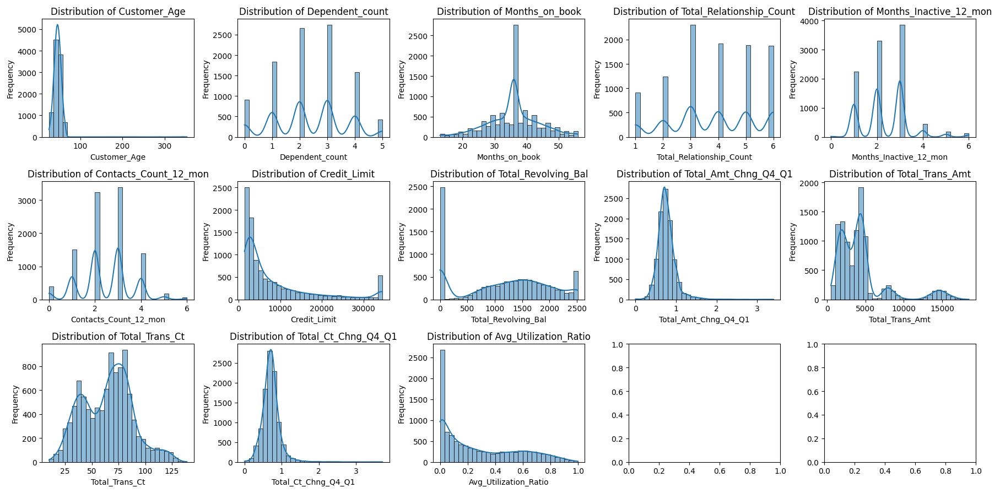
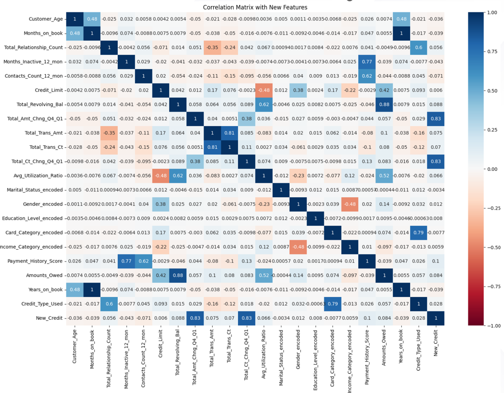
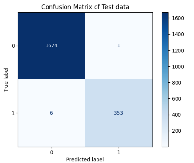

# customer-credit-prediction

### Table of Contents ###
- [Project Overview](#project-overview)
- [Scenario](#scenario)
- [Tools & Methodology](#tools--methodology)
- [Data Visualisation](#data-visualisation)
- [Achievements & Impact](#achievements--impact)
- [Key Achievements](#key-achievements)

--- 

### Project Overview
Analyze financial data to detect fraud using machine learning and predictive analytics by utilizing various analytical methodologies to extract insights from financial datasets, focusing on indicators like current ratio, return on assets, and MScore.

### Scenario
The project aims to identify financial irregularities and predict fraudulent activities within companies by analyzing financial metrics and patterns.
- Data Preparation: Employed Power Query for data cleaning, ZScore for outlier detection, and Excel tools for replacing outliers.
- Analysis Techniques: Used descriptive statistics, regression analysis, and logistic regression for predictive analytics.
- Visualization: Created dashboards using Tableau to visualize financial performance and fraud detection insights.

### Tools & Methodology
In this financial analysis for stock fraud detection, several tools and techniques are used to ensure data accuracy, extraction, and predictive modeling:

1. **Power Query**: Power Query is used for data cleaning and formatting. It helps in identifying and removing inconsistencies, duplicates, and errors in the dataset. By automating data preparation tasks, Power Query ensures the data is clean and ready for analysis.

2. **Pivot Tables**: Pivot tables are utilized to extract and organize large volumes of data quickly. They allow the creation of summaries, such as averages and counts, which are essential for identifying trends or anomalies. This helps in efficiently analyzing key financial metrics and stock-related data.

3. **Outlier Removal**: Outliers, or abnormal data points, are removed to improve the quality of the analysis. Detecting and removing these outliers prevents skewed results and enhances the accuracy of the model.

4. **Python for Machine Learning**: Python is employed to build predictive models using machine learning techniques. After the data is cleaned and formatted, Python libraries such as scikit-learn are used to train models that detect patterns and predict potential stock fraud. This combination of structured data analysis and advanced predictive modeling leads to high accuracy in identifying fraudulent activities.

      [Credit Score Classification Prediction - Python Code Link](./Credit_Score_Prediction.ipynb)

      **Numerical Data Distribution**
   
      
   
      **Categorical Count Plot**
   
      

      **Correlation Heatmap With New Features**
   
      

      **Confusion Matrix**
   
      
   
These tools collectively enhance the financial analysis process by ensuring data integrity, extracting valuable insights, and applying machine learning for fraud detection.

### Data Visualisation
Visualized data to highlight companies’ financial health, profitability, and risk levels. Identified high-risk companies and those with significant debt growth.

 - Pivot Table
   
  

 - Tableau Dashboard
   
  

### Impact
Provided a robust tool for stakeholders to make informed decisions regarding investments and risk management

### Key Achievements
Key Achievements: Developed a logistic regression model with 92.40% accuracy for fraud detection. Identified significant financial metrics impacting company performance.

